# manual steps for creating a TFE airgap installation

## image with docker software
- make sure you have created the ubuntu image with docker you can use 

## network related
- Create a VPC with cidr block 10.233.0.0/16
    
- Create 2 subnets. 1 public subnets and 1 private subnet
patrick-public1-subnet (ip: 10.233.1.0/24 availability zone: eu-north-1a)
patrick-private-subnet (ip: 10.233.11.0/24 availability zone: eu-north-1a)
patrick-private2-subnet (ip: 10.233.11.0/24 availability zone: eu-north-1b)
      
   
- create an internet gateway
    
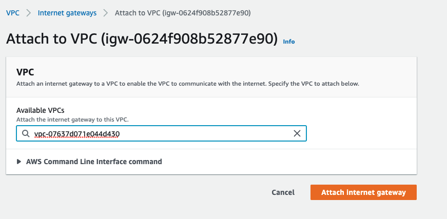    
- create routing table for public
     
- add the route to the subnet
    
- create a security group that allows ssh, https,replicated admin portal and postgresql 5432 from your own machine
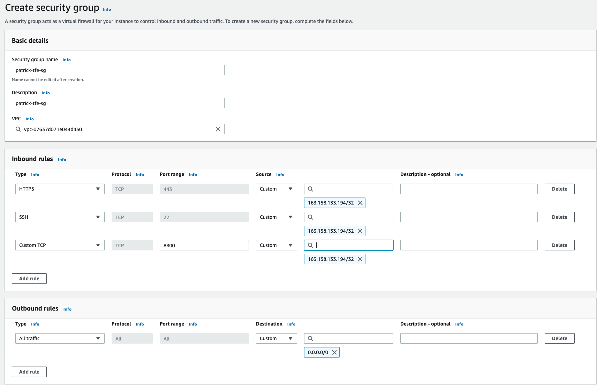   

## create the instance
- create an instance using the ubuntu image with docker installed
using AMI: ami-039a9e6a0ebccb34b
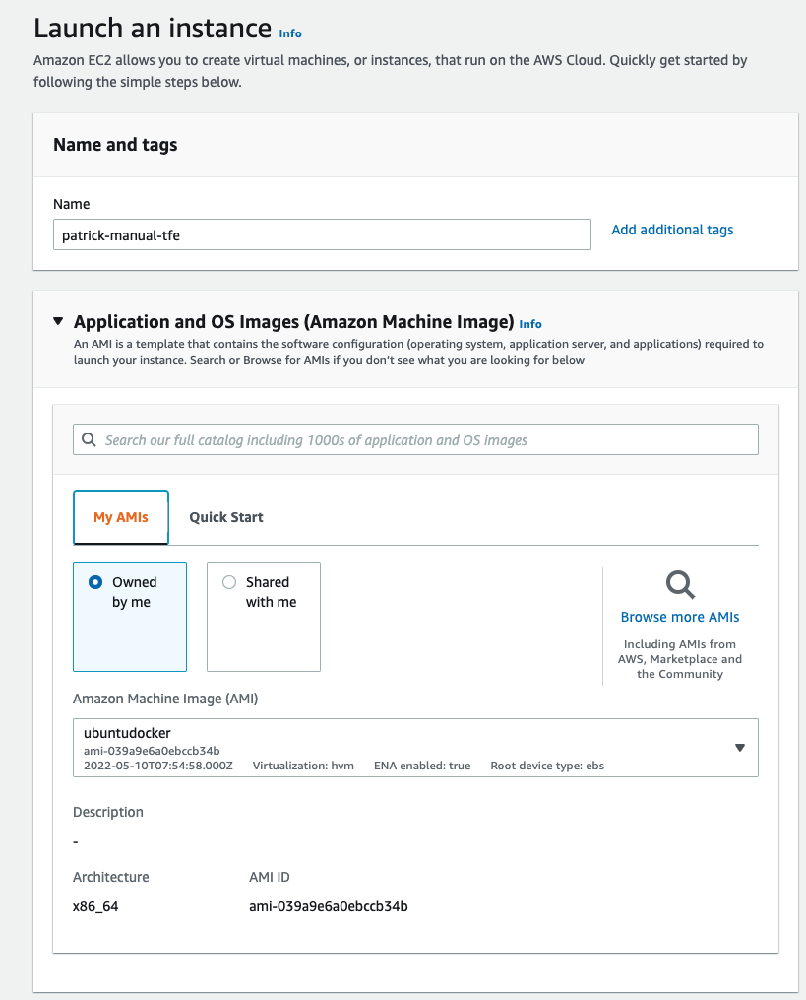     
      
      

## create the RDS postgresql instance
- PostgreSQL instance version 12
    
    
    
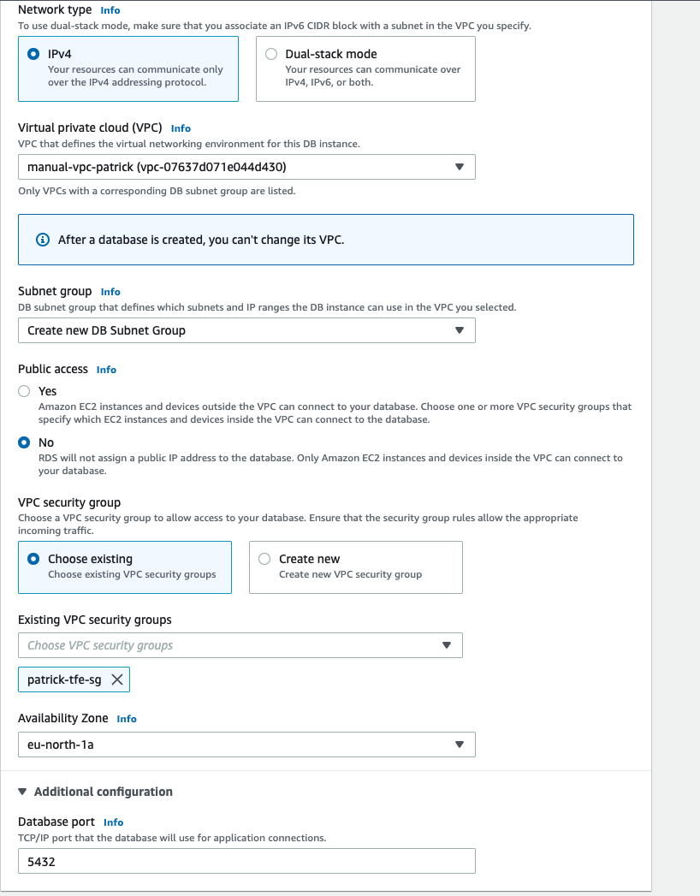    
    
    
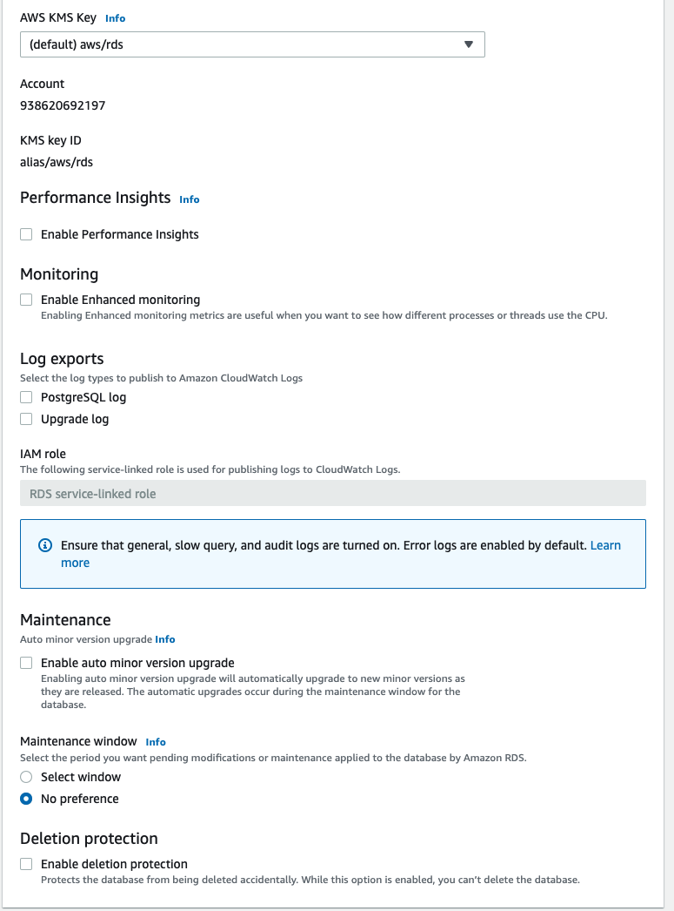    
endpoint: patrick-manual-tfe.cvwddldymexr.eu-north-1.rds.amazonaws.com

# AWS to use
- create a bucket patrick-tfe-manual  
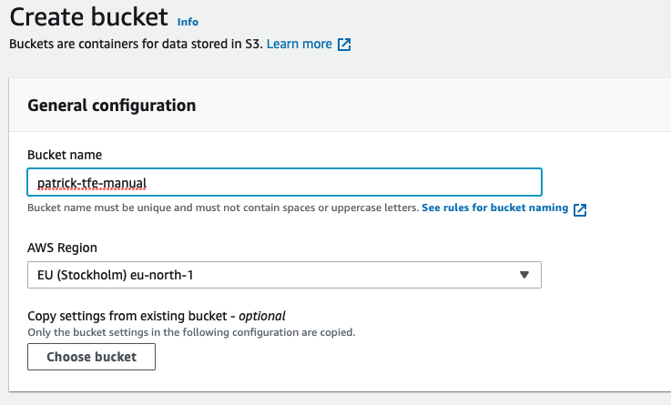  
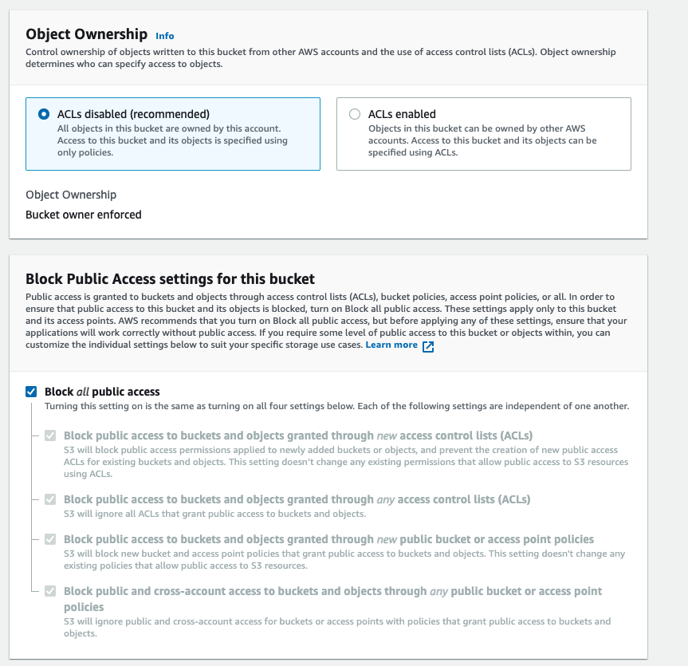  
      

aws s3 cp test.txt s3://patrick-tfe-manual/test.txt

- create policy to access the bucket from the created instance
    
- create a new policy
```
{
    "Version": "2012-10-17",
    "Statement": [
        {
            "Sid": "VisualEditor0",
            "Effect": "Allow",
            "Action": [
                "s3:PutObject",
                "s3:GetObject",
                "s3:ListBucket",
                "s3:DeleteObject",
                "s3:GetBucketLocation"
            ],
            "Resource": [
                "arn:aws:s3:::patrick-tfe-manual",
                "arn:aws:s3:::*/*"
            ]
        },
        {
            "Sid": "VisualEditor1",
            "Effect": "Allow",
            "Action": "s3:ListAllMyBuckets",
            "Resource": "*"
        }
    ]
}
```
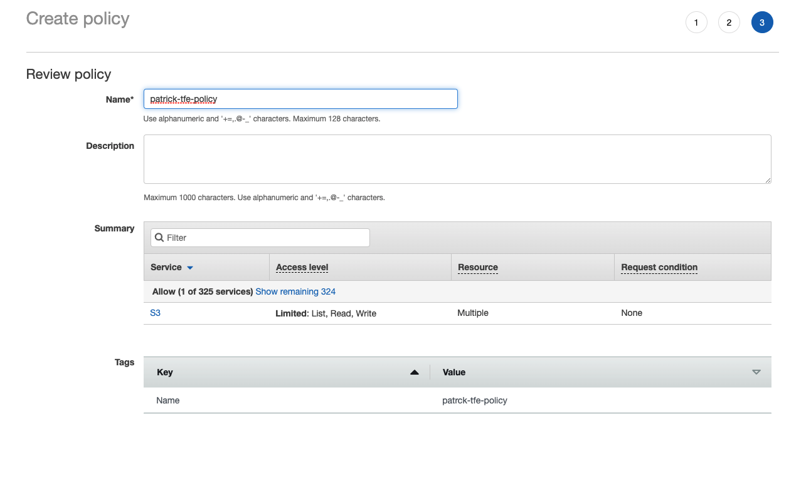    
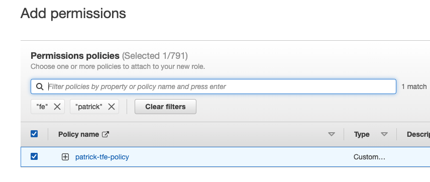    
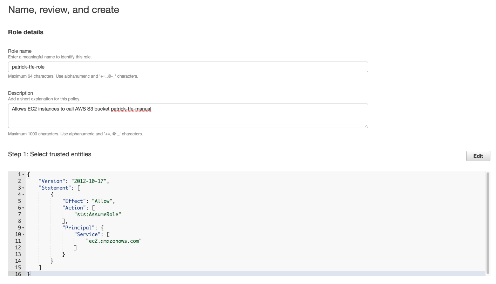    
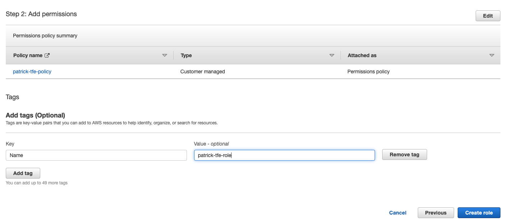    

- attach the role to the instance
    
- you should now be able to upload a file to the s3 bucket
```
ubuntu@ip-10-233-1-81:~$ aws s3 cp test.txt s3://patrick-tfe-manual/test.txt
upload: ./test.txt to s3://patrick-tfe-manual/test.txt
```

## create the certificate TLS to use
dns: patrick-tfe.bg.hashicorp-success.com

used the following manual to create it: https://github.com/munnep/nginx_create_certificates
```
certbot -d patrick-tfe.bg.hashicorp-success.com --manual --preferred-challenges dns certonly
```
files stored under ../certificates/


## Packer ubuntu with docker installation
- go to directory packer_image_docker_installed
```
cd packer_image_docker_installed
```
- initialize packer
```
packer init .
```
- build the image
```
packer build .
```
- Check in AWS console you have the image
  

# done
- [x] Create an AWS image to use with correct disk size and Docker software installed
- [x] build network according to the diagram
- [x] Create an AWS RDS PostgreSQL
- [x] Create an AWS bucket
- [x] Create a valid certificate to use 
- [x] Get an Airgap software download


# To do
- [ ] create a virtual machine in a public network with public IP address.
    - [ ] firewall inbound are all from user building external ip
    - [ ] firewall outbound rules
          postgresql rds
          AWS bucket
          user building external ip
- [ ] transfer files to TFE virtual machine
      - airgap software
      - license
      - TLS certificates
      - Download the installer bootstrapper
- [ ] point dns name to public ip address
- [ ] install TFE
- [ ] create a TFE user organization and workspace to test the functionality
