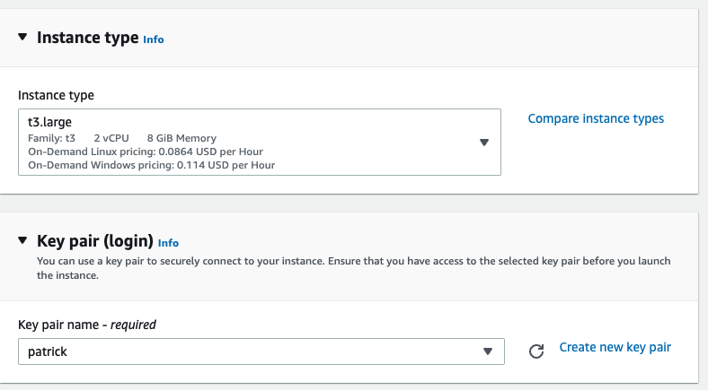

# manual steps for creating a TFE airgap installation

## image with docker software
- make sure you have created the ubuntu image with docker you can use 

## network related
- Create a VPC with cidr block 10.233.0.0/16
    
- Create 2 subnets. 1 public subnets and 1 private subnet
patrick-public1-subnet (ip: 10.233.1.0/24 availability zone: eu-north-1a)
patrick-private-subnet (ip: 10.233.11.0/24 availability zone: eu-north-1a)
      
   
- create an internet gateway
    
    
- create routing table for public
     
- add the route to the subnet
    
- create a security group that allows ssh, https and replicated admin portal from your own machine
   

## create the instance
- create an instance using the ubuntu image with docker installed
using AMI: ami-039a9e6a0ebccb34b
     
      
      

## create the RDS postgresql instance


## Packer ubuntu with docker installation
- go to directory packer_image_docker_installed
```
cd packer_image_docker_installed
```
- initialize packer
```
packer init .
```
- build the image
```
packer build .
```
- Check in AWS console you have the image
  

# done
- [x] Create an AWS image to use with correct disk size and Docker software installed
- [x] build network according to the diagram


# To do
- [ ] Create an AWS bucket
- [ ] Create an AWS RDS PostgreSQL
- [ ] Create a valid certificate to use 
- [ ] Get an Airgap software download
- [ ] create a virtual machine in a public network with public IP address.
    - [ ] firewall inbound are all from user building external ip
    - [ ] firewall outbound rules
          postgresql rds
          AWS bucket
          user building external ip
- [ ] transfer files to TFE virtual machine
      - airgap software
      - license
      - TLS certificates
      - Download the installer bootstrapper
- [ ] point dns name to public ip address
- [ ] install TFE
- [ ] create a TFE user organization and workspace to test the functionality
